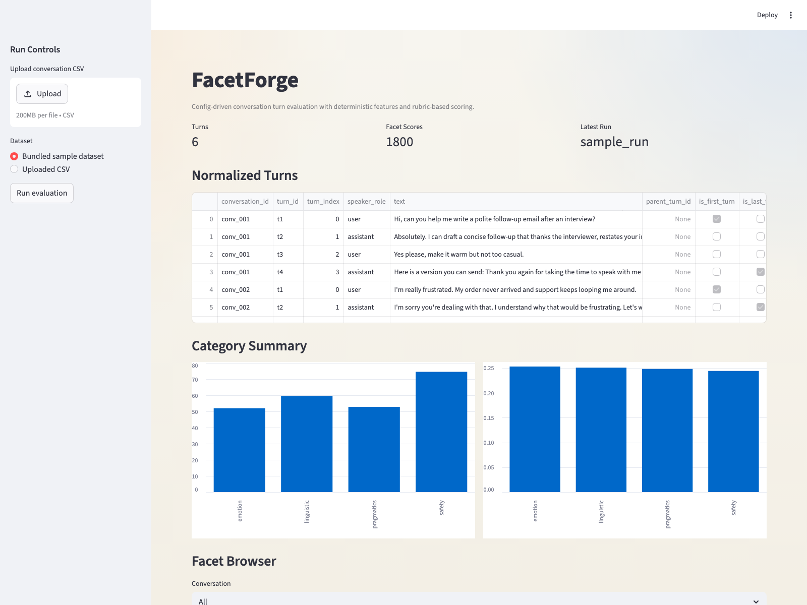
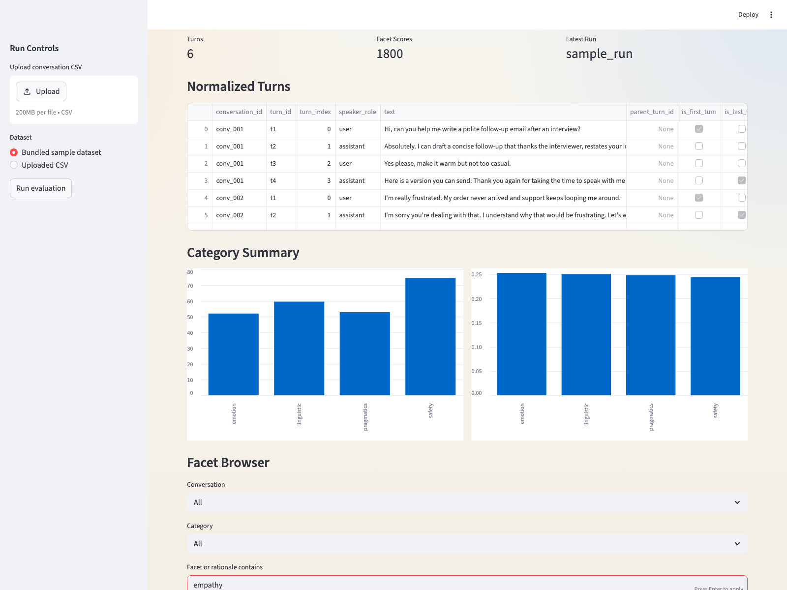
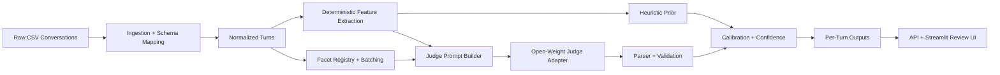

# FacetForge

FacetForge is a config-driven conversation turn evaluator built to score each turn across 300 ordered facets spanning linguistic quality, pragmatics, safety, and emotion. The architecture is designed to scale from 300 to 5000+ facets by configuration and batching strategy, not by rewriting core logic.




## Why This Repo Exists
- Config-driven facet registry instead of prompt-embedded logic
- Deterministic feature extraction for observable signals
- Open-weight judge adapters for nuanced rubric scoring
- Calibration and confidence derived from measurable signals
- Dockerized baseline with FastAPI API and Streamlit review UI
- Exportable outputs that remain auditable turn-by-turn and facet-by-facet

## System Design


## Repository Layout
```text
FacetForge/
├── configs/
│   ├── facets/
│   ├── models/
│   └── scoring/
├── data/
│   ├── processed/
│   ├── raw/
│   └── samples/
├── docs/screenshots/
├── notebooks/
├── outputs/
│   ├── predictions/
│   └── reports/
├── scripts/
├── src/
│   ├── api/
│   ├── evaluation/
│   ├── facets/
│   ├── features/
│   ├── inference/
│   ├── ingestion/
│   ├── scoring/
│   ├── ui/
│   └── utils/
└── tests/
```

## What Ships In This Baseline
- 300 seeded facets:
  - `linguistic`: 90
  - `pragmatics`: 90
  - `safety`: 60
  - `emotion`: 60
- Ordered score labels: `10, 25, 50, 75, 90`
- Flexible CSV schema inference for `conversation_id`, `turn_id`, `speaker`, and `text`
- Deterministic features for lexical quality, pragmatics, safety, and emotion
- Grouped facet batching for judge prompts
- Inference adapters for `openai_compatible`, `vllm`, and `ollama`
- Hybrid aggregation that falls back to heuristic-only scoring when no live judge endpoint is configured
- Reviewable outputs with per-facet score, confidence, rationale, evidence, and metadata

## Inference Strategy
FacetForge is wired for open-weight judge models only. Recommended baselines:

- `Qwen2.5-7B-Instruct`
- `Qwen2.5-14B-Instruct`
- `Gemma 2 9B`
- `Llama 3 8B Instruct`
- `Mistral 7B Instruct`

When `FACETFORGE_MODEL_PROVIDER=none`, the platform still runs end-to-end using deterministic features plus calibrated heuristic priors. That keeps the pipeline, exports, API, and UI runnable without pretending that an LLM judged the turn.

## Quick Start
```bash
python3 -m pip install -r requirements.txt
cp .env.example .env
PYTHONPATH=src python3 scripts/generate_facet_configs.py
PYTHONPATH=src python3 scripts/generate_sample_dataset.py
PYTHONPATH=src python3 scripts/run_pipeline.py --input data/samples/sample_conversations.csv --run-id sample_run
```

## Run The API
```bash
PYTHONPATH=src uvicorn api.app:app --reload --app-dir src
```

Health check:

```bash
curl http://127.0.0.1:8000/health
```

## Run The Review UI
```bash
PYTHONPATH=src streamlit run src/ui/streamlit_app.py
```

The UI supports:
- uploading a CSV or using the bundled sample dataset
- previewing normalized conversations
- triggering the real evaluation pipeline
- filtering by conversation, category, or facet text
- exporting filtered results to CSV

## Docker
```bash
cp .env.example .env
docker compose up --build
```

Services:
- API: `http://127.0.0.1:8000`
- Streamlit UI: `http://127.0.0.1:8501`

## CLI And Scripts
- `scripts/run_pipeline.py`: end-to-end pipeline runner
- `scripts/generate_sample_dataset.py`: bundled demo dataset generator
- `scripts/generate_facet_configs.py`: seeded 300-facet registry generator
- `scripts/validate_facets.py`: registry and batching validation

Example pipeline command:

```bash
PYTHONPATH=src python3 scripts/run_pipeline.py \
  --input data/samples/sample_conversations.csv \
  --run-id demo_run
```

## Output Artifacts
FacetForge writes:

- `outputs/predictions/<run_id>_turn_results.jsonl`
- `outputs/predictions/<run_id>_facet_results.csv`
- `outputs/reports/<run_id>_normalized_turns.csv`
- `outputs/reports/<run_id>_features.csv`
- `outputs/reports/<run_id>_category_summary.csv`
- `outputs/reports/<run_id>_manifest.json`

Per facet, the exported schema includes:
- `facet_id`
- `facet_name`
- `category`
- `score`
- `confidence`
- `short_rationale`
- `evidence_span`
- `abstain`
- `heuristic_score`
- `judge_score`
- `source`
- `rubric_version`

## Testing
```bash
PYTHONPATH=src pytest
```

## Product Framing
> I designed it as a config-driven evaluation platform rather than a one-shot prompt solution. Facets live in a registry, deterministic code extracts observable signals, grouped rubric packets drive the judge model, and a calibration plus confidence layer stabilizes outputs while keeping the system auditable.
